<h2 align="center">
  Fingerprint APS
</h2>

 

<h3 align="center">
  
  
</h3>

---

## 📃 Sobre

**Fingerprint APS** é um projeto mobile desenvolvido com Flutter para apresentação de um trabalho na faculdade que tenho todo semestre, chamado APS. Basicamente, o tema do trabalho era *DESENVOLVIMENTO DE UM SISTEMA DE IDENTIFICAÇÃO E AUTENTICAÇÃO BIOMÉTRICA*.

---

## Plano de desenvolvimento da aplicação

Com relação à construção do projeto, o mesmo foi feito utilizando o “VSCode”,
que é um editor de código-fonte muito utilizado no mercado de trabalho e que dá
suporte para várias linguagens e ou frameworks, tal como no caso do “Flutter” e do
“Dart”. Um dos requisitos para a construção deste projeto era ter instalado na máquina
de trabalho o “SDK” do Flutter para ser possível a compreensão de seu código, e
como facilitador tem-se a adição de um “CLI” próprio para facilitar o uso de comandos
de acesso ao “Flutter” via terminal (ou seja, foi-se adicionado na variável “PATH” do
computador o caminho onde o binário do Flutter estava para que dessa forma, via
linha de comando, fosse possível a execução de comandos “Flutter”).
A versão do “Flutter” usado no mesmo foi a versão “2.2.3” e que depois fora atualizado, estando agora com a versão "2.10.1", e ambas versões já faziam o uso do “NullSafety”, que foi uma nova funcionalidade trazida no “Flutter”, relativamente recente, na qual teve uma melhora muito grande com relação a inteligência do compilador, obrigando, assim, seus desenvolvedores a tratarem o nulo de forma correta, evitando ocasionais “bugs” que o mesmo gerava com frequência relativamente grande, uma vez que um tratamento errado com este tipo de dado pode muito facilmente quebrar a aplicação, gerando uma tela vermelha para o usuário final. Com o objetivo de trazer uma experiência bem próxima de produtos que estão, também fora adicionado o conhecido CI / CD no projeto, a fim de automatizar alguns processos e melhorar a qualidade do produto final, por meio dessas automações. Basicamente, é um método que visa entregar aplicações com frequência aos clientes. Com relação a suas aplicações neste projeto, com o “CI” é feito a integração contínua, validando algumas questões, como se todos os testes unitários estão funcionando de fato, se não houve nenhum conflito entre ramificações, se a aplicação está “buildando” em erros e entre outros.
Com o “CD”, é possível de maneira muito fácil gerar os “.apk” para o Android, bastando apenas atualizar a versão do projeto por meio das tags do git, de forma que ao criar uma nova “release” (uma nova tag do git ao projeto), o mesmo faz todas as validações necessárias e após isso gera o aplicativo e também seu “appbundle” (é o arquivo que pode ser jogado na loja referente ao aplicativo), deixando fácil de baixá-los e assim poder repassar para alguém. Ainda sobre sua aplicação com relação a este projeto em específico, o mesmo foi configurado para o “Github” (uma plataforma na nuvem que serve para hospedagem de códigos fonte, além de fornecer várias funcionalidades), de forma a explorar a ferramenta do “Github” chamada “Github Actions”, no qual está a integração com o CI / CD. Juntamente desta ideia, também foi adicionado alguns testes unitários no projeto, a fim de garantir que algumas funcionalidades de fato estivessem funcionando, além de que grandes projetos sempre devem possuir testes unitários, uma vez que uma das etapas para se ter um código de qualidade é garantir que o mesmo continua funcionando, e a melhor forma de fazer isso é por meio dos testes unitários.
No desenvolvimento mobile, é possível criar aplicativos utilizando linguagens de programação que são específicas de cada plataforma (nativas), ou fazendo uso de frameworks híbridos, que atendem todas as plataformas. No caso deste projeto, fora utilizado o “Flutter” que é um framework híbrido. Para a utilização de alguns recursos nativos por meio deste tipo de framework, é preciso fazer uso de bibliotecas chamadas de “packages”, de forma que por debaixo dos panos tais “packages” se comunicam
diretamente com o nativo, pois cada plataforma tem seu tratamento específico para seus recursos. Consequentemente, vê-se que é muito raro haver aplicativos “Flutter” que não façam uso de nenhum package, assim como neste projeto algumas bibliotecas foram usadas.
Todas as bibliotecas que foram utilizadas no projeto e o motivo de uso das mesmas:
* asuka: Traz várias facilidades com relação ao gerenciamento do contexto da aplicação, sendo usado no projeto para mostrar modais e “SnackBars” (para demonstração de mensagens alertando o usuário de algo, e que aparecem na parte inferior da tela e ficam presentes por apenas quatro segundos);
* auto_size_text: Provê um componente que adapta o tamanho do texto para caber no espaço disponível, ajudando assim na responsividade;
* bloc: No Flutter temos os chamados gerenciamentos de estados, técnicas que facilitam a troca de informações entre componentes, uma vez que a árvore de “Widgets” (componentes) pode ser muito grande e dificultar o acesso do mesmo. Um desses gerenciadores de estados é o “Bloc”, que fora utilizado na
aplicação inteira para por exemplo armazenar a instância do usuário na aplicação e ouvir suas eventuais mudanças, de forma a estar disponível em cada página do sistema. Existe um padrão chamado “Bloc Pattern” que também serve para gerenciar estados, mas, é diretamente através de streams nativas, e existe o “Bloc Provider” que também faz tal gerenciamento e que por baixo dos panos faz uso de “streams”, mas, não de forma direta, inclusive tendo uma alternativa fornecida chamada “Cubit” que é uma forma simplificada de tal gerenciamento e que pode ser usada em telas mais simples. Especificamente nesta aplicação, fora usado o “Bloc Provider” e o “Cubit”;
* cupertino_icons: Traz uma série de ícones para a padronização Cupertino (design voltado para iOS), que não fora utilizado, mas, que vem por padrão em todo projeto Flutter;
* faker: Usado para “mockar” (gerar) dados fictícios que são usados nos testes unitários;
* flutter_bloc: É usado em conjunto com o “package” “bloc”, mas, este especificamente provê os “Widgets” que fazem acesso direto ao estado, para que possam realizar ações ou atualizar a tela automaticamente caso o estado da aplicação associado ao seu uso seja alterado;
* flutter_modular: Serve para facilitar a disponibilização das dependências na aplicação, fazendo o chamado gerenciamento dos “binds” e também para melhorar a estruturação das rotas da aplicação, de forma a evoluir a qualidade da arquitetura do projeto, tornando-o mais escalável, dando também a possibilidade de modularizar o projeto de forma fácil, trazendo outros recursos juntamente também. É um package usado por grandes empresas que trabalham com “Flutter” no Brasil;
* flutter_native_splash: Permite a adição de forma fácil de uma “SplashScreen” nativa, pois todo  aplicativo em “Flutter” leva um pequeno tempo para de fato ser iniciado, e durante esse tempo é mostrado está “SplashScreen” nativa;
* hive: Trata-se do banco de dados offline que fora utilizado no aplicativo para armazenar os dados do usuário necessários, inclusive se o mesmo está logado ou não. É um dos mais rápidos em gravação e leitura de dados que está disponível no “Flutter”;
* hive_flutter: Usado em conjunto com o package “hive”, trazendo algumas funcionalidades que são imprescindíveis para o funcionamento deste banco de dados offline;
* local_auth: No que se refere o tema do projeto, é o package mais importante de todos, pois é este quem fornece a opção de usar a biometria, e também fazer a verificação se a biometria testada realmente está presente no dispositivo;
* build_runner: É um package obrigatório de ser usado junto do package “hive”, pois o “hive” trabalha com geradores de código por meio de outro package chamado “hive_generator”, e este outro package necessita do “build_runner” para que possa ser usado;
* flutter_launcher_icons: Utilizado para gerar o ícone do aplicativo;
* flutter_lints: Permite a adição de “lints” ao projeto, que é uma espécie de regras que devem ser seguidas para manter a qualidade do código alta, e que são definidas por meio de convenções, de forma que ao quebrar alguma “regra”, o compilador mostra um alerta ao desenvolvedor. Seu intuito é melhorar a
qualidade do código do projeto;
* hive_generator: O package “hive” trabalha com o que é chamado de gerador de código, de forma que por meio de “decorators” é possível definir as entidades que é preciso salvar no banco de dados offline, e quem de fato monta da forma que é preciso o que será salvo no “hive” é o código gerado fazendo
uso das definições dadas nos “decorators” por meio do “hive_generator”.

A respeito do fluxo da aplicação, basicamente ao abrir o aplicativo pela primeira
vez, é exibido primeiramente a “SplashScreen” nativa, e depois a “SplashScreen” do
“Flutter”, e durante a exibição destes, é feito o carregamento de tudo que é necessário
para poder fazer uso do aplicativo. Após isso, o usuário é levado para a página de
criação de conta, afinal, está entrando no aplicativo pela primeira vez e ainda não
possui conta. Nesta página, haverá dois campos para preencher digitando,
respectivamente o login e a senha, e um campo de escolha em que o usuário não
digita, apenas clica e abre uma caixa com três opções para escolher, sendo as opções
“Permissão um”, “Permissão dois” e “Permissão três”, ou seja, é o nível de permissão
que o usuário criará a conta. Além disso, há um botão de cadastrar, em que se o
usuário clicar sem ter preenchido qualquer um dos três campos, os mesmos ficarão
em vermelho com um texto de orientação abaixo explicando que tal campo é
obrigatório de ser preenchido e também irá aparecer uma “SnackBar” na parte inferior
da tela (uma barra azul que serve de alerta) com a mensagem dizendo para arrumar
os campos em vermelho. Ou seja, este é o tratamento que existe para a criação do
usuário, de forma a evitar inconsistência de dados. Além disso, o login e a senha
devem possuir seis ou mais caracteres cada um, e caso os mesmos não sejam
atendidos, ao clicar em cadastrar, os campos também ficarão marcados em vermelho
para indicar falha no preenchimento dos dados. Uma vez preenchido corretamente os
dados e clicado em cadastrar, o usuário será criado e armazenado no banco de dados
offline (“hive”), e a pessoa será alocada para outra página.
Uma vez que o usuário tenha criado uma conta ou abra o aplicativo após ter
criado a conta sem ainda ter feito o logout, o usuário sempre estará presente na página
conhecida como “home”, em que é uma página cujo a barra superior contém o login
do usuário, e há uma barra inferior com duas opções para amostragem de conteúdo.
A primeira opção, que já vem aberta por padrão, é a de informações, em que serão
mostrados para o usuário as informações associadas ao nível de permissão do
mesmo. Já na segunda opção, estará presente o mesmo formulário que a pessoa tinha para a criação do
usuário, porém, com os dados já preenchidos, e em baixo haverá dois botões, que
são o de atualizar dados e o de deletar a conta. Os campos possuem os mesmos
tratamentos que tinham na parte de criação do usuário, portanto, é aqui que o usuário
pode atualizar seus dados ou ainda deletar sua conta. Caso algum erro seja
encontrado na validação dos campos ao atualizar os dados, será mostrado uma
“SnackBar” na parte inferior também. No caso do botão de excluir a conta, ao clicar
nele, será mostrado um modal de confirmação para que o usuário cancele ou
concretize a operação. Caso clique em cancelar, nada acontece, apenas o modal
fecha, mas, se clicar em confirmar, então a conta é automaticamente excluída, e a
pessoa é redirecionada para a página de criação de usuário, uma vez que a sua conta
foi excluída.
Ainda sobre a página “home”, na barra do aplicativo (“AppBar”), além do texto
contendo o login do usuário, há um botão para ser feito o logout, ou seja, sair da conta.
Ao clicar nele é mostrado outro modal de confirmação, cujo cancelamento apenas o
fecha, e a confirmação faz a pessoa ir para outra página, a página de login. Uma vez
que o usuário ainda tenha a conta salva no “hive” (já tenha sido criada e não tenha
sido excluída, obviamente) e tenha feito o logout, sempre que o mesmo abrir o
aplicativo irá aparecer na página de login.
A página de login também contém um formulário, mas, apenas com os campos
de login e senha do usuário e um botão escrito “Fazer Login”. Estes campos possuem
também a mesma validação dos demais, além de que caso os dados digitados
passem da validação, é feito uma busca no “hive” para validar se os dados estão
corretos, e se estiverem, o usuário passa então a estar logado sendo deslocado
novamente para a página “home”. Ainda sobre esta página de login, há um botão com
um ícone de digital no canto inferior direito do dispositivo, e é aqui que está sendo
realizado o foco do trabalho que é a autenticação via digital, em que ao clicar no botão,
primeiro é validado se o dispositivo tem o recurso de autenticação, e caso não tenha,
é mostrado um modal avisando a pessoa, mas, caso tal recurso esteja presente, é
mostrado também um modal pedindo para que a pessoa coloque o dedo no sensor a
fim de tentar fazer a validação da biometria. Caso a mesma falhe, neste mesmo modal,
será notificado que a autenticação falhou para alertar o usuário, e caso dê certo, o
usuário realiza o login automaticamente, voltando, portanto, para a página “home”.
Foram abordados vários recursos visuais e que geralmente são encontrados
em aplicações móveis, como botões, textos, barras em cobra (“SnackBar”), campos
de texto (“TextField”), modais (“showGeneralDialog”), barra do aplicativo (“AppBar”),
imagens (“Image.asset”), ícones (“Icon”), barras inferiores (“bottomNavigationBar”) e
entre outros.
Além disso, para garantir melhores práticas de programação, utilizou-se o git
para fazer o versionamento do código, ficando dessa forma fácil de pontuar onde,
quando e o que foi alterado em dados pontos do desenvolvimento, uma vez que a
cada série de melhorias que foram sendo desenvolvidas e ou bugs que foram sendo
encontrados e corrigidos foi-se feito um “commit” de forma semântica para pontuar
tais alterações.

---

## Projeto do programa
A linguagem escrita utilizada no projeto foi o inglês, ou seja, cada arquivo dentro
do projeto do dispositivo móvel está escrito em inglês na linguagem de programação
“Dart”, assim como o nome das pastas.
A estruturação do projeto em si foi moldada de forma a respeitar as
especificidades do framework (“Flutter”), buscando atingir uma boa separação das
responsabilidades das partes desenvolvidas. Para tratar da estruturação de pastas,
primeiramente deve-se entender a estrutura base de todo projeto criado com este
framework. No caso do desenvolvimento mobile há alguns detalhes importantes de
notar, como o fato de que existem as linguagens nativas para o desenvolvimento de
cada plataforma. No caso do Android, pode-se desenvolver aplicativos com Kotlin e
até mesmo com Java. Já no caso do iOS, há as opções do Swift e do Objective-C.
Essas linguagens se comunicam diretamente com os seus respectivos hardwares, de
forma a ser possível criar aplicativos móveis específicos para cada um desses
dispositivos citados que eles atendem. Como já fora comentado anteriormente, o
“Flutter” é um Framework híbrido, ou seja, uma mesma aplicação feita nele irá
funcionar tanto no Android quanto no iOS; sendo importante apenas tratar as
especificidades visuais de cada plataforma, em que o próprio framework fornece a
biblioteca “Material” para seguir o padrão do Android, e a biblioteca “Cupertino” para
o iOS. Especificamente para este projeto, fora tratado apenas o uso da biblioteca
“Material”. Com isso, já é possível entender como funciona a estrutura padrão de um
projeto “Flutter”, em que o mesmo contém as pastas “.dart_tool” e “.idea“, de forma
que ambas contém especificidades do “Dart”, então nem deve-se mexer nelas; depois
tem-se a pasta “build“ onde irá estar o aplicativo gerado independente da forma que
for compilado (no “Flutter” é possível gerar o aplicativo para três fins diferentes, que
são para desenvolvimento conhecido como modo “debug”, o modo “profile” para fazer
testes de performance e monitoramento de custo de hardware, e por fim o “release”
que é o aplicativo otimizado que irá para o usuário final); as pastas “android” e “ios”
que contém a ligação com o projeto “Flutter” e é graças a elas que pode-se rodar o
projeto em ambas plataformas, e no caso dessas pastas, são em casos bem
específicos, mas, às vezes é necessário mexer um pouco em alguns arquivos internos
seus, como por exemplo neste projeto foi necessário adicionar a permissão de
biometria para que a mesma pudesse funcionar no Android, de forma a adicioná-la no
arquivo “AndroidManifest.xml”, além de que o package para tratamento de biometria
(“local_auth”) exigia algumas alterações no arquivo principal da pasta do android, e
no caso tais alterações ocorreram direto no arquivo “MainActivity.kt”; continuando com
relação às pastas, pode haver uma pasta chamada “.vscode” que só irá aparecer no
projeto se estiver sendo usado o editor de texto “VSCode”, que foi o caso deste
trabalho. Tal pasta contém configurações a respeito do projeto neste editor de texto.
Por fim, a principal pasta a ser tratada é a pasta “lib”, onde todo o código “Flutter”
estará presente, e é nela onde foi trabalhado a grande maioria do aplicativo.
Uma vez citado isso, pode-se focar agora totalmente na parte de “Flutter” e na
arquitetura em si que foi montada do projeto. Primeiramente, é importante também
saber os arquivos padrões do “Flutter”; que são o “main.dart” que é o primeiro arquivo
a ser executado no programa, e tal arquivo contém dentro de si uma função chamada
“main” e é ela quem de fato inicia a execução deste; o arquivo “pubspec.yaml” que é
o gerenciador de bibliotecas do Flutter, sendo nele que todas as novas bibliotecas que
se queira adicionar devem ser colocadas; e o arquivo “pubspec.lock” que segue
alinhado com o “pubspec.yaml”. Além desses, mais alguns arquivos vêm por padrão,
mas, nestes outros, não é recomendado sua manipulação.
Para deixar o aplicativo o mais próximo possível de grandes aplicativos do
mercado, foi-se feito uso do “Clean Architecture” como citado anteriormente. Fazendo
uso do package “flutter_modular”, foi-se possível melhorar mais ainda o uso desta
arquitetura, uma vez que todo o projeto passa a ser montado em forma de módulos,
onde cada módulo pode ser uma “feature” (funcionalidade) ou uma página, de forma
que no contexto desse projeto, cada página é um módulo. A respeito desta arquitetura,
basicamente, o mesmo provê cinco camadas que irão ser usadas de acordo com a
necessidade. A primeira camada é a de “UI”, que é onde ficará toda a parte visual, a
tela em si montada, mas, a mesma não deve ter nenhuma responsabilidade de conter
regras de negócios. A próxima camada, é a camada de “Presenter”, e é ela quem
estará sendo usada diretamente dentro da página; dentro dela terá a pasta de
“controller”, de forma que todo controle de fluxos será feito aqui, além de que dentro
do “controller” pode-se criar classes para gerenciar o estado, de forma que no seu
respectivo arquivo de “controller”, será feito a atualização e gerenciamento deste
estado, tornando reativo a forma de atualização da página. Ainda nesta camada, é
possível ter outra camada interna chamada de “ViewModels”, que é um modelo de
classe para ter os dados necessários que a tela irá passar para o “controller”, de forma
a poder providenciar o controle das lógicas do que deve ocorrer ao executar
determinada ação. Uma técnica muito visada em relação a qualidade de código, é
nunca depender de implementações e sempre de interfaces, de forma que uma
interface é um contrato, um modelo a ser seguido sobre a composição de uma certa
lógica, dessa forma, a partir da camada de “Presenter”, toda camada terá uma
interface que será uma porta de entrada para a camada mais interna, sendo que as
camadas mais internas não devem conhecer as mais externas; então, dessa forma,
todas implementações irão implementar as interfaces para de fato moldarem suas
características a partir de tal contrato, de forma que fique fácil substituir as
implementações caso isso seja necessário no futuro. Ainda na camada de “Presenter”,
portanto, teremos além da pasta interna de “controller”, a pasta de “usecases”, onde
estarão todas as interfaces de caso de uso que serão implementadas na pŕoxima
camada, a camada de “Domain”. Nesta camada de “Domain”, é onde estará toda a
lógica em si, todos os cálculos, soluções de regra de negócio e afins. A representação
destes é feita por meio de “usecases”, que contém lógicas implementadas sobre cada
funcionalidade. Tais “usecases” irão implementar todas interfaces de usecases
providas pela camada anterior, a camada de “Presenter”; desta forma, esta camada
mais interna não conhecerá nada da camada mais externa, apenas suas interfaces
que são as portas de entrada. Ainda no “Domain”, é possível ter uma pasta interna
além da pasta de “usecases”, que é a de “entities”, que serão a representação das
entidades do sistema. Quando é preciso buscar dados, sejam dados buscados via
internet (no caso, requisições à API’s) ou até mesmo dados localmente (como em
banco de dados offline), então é preciso a implementação de mais duas camadas que
são as mais internas após o “Domain”, então, neste caso é preciso que dentro do
“Domain” esteja presente uma pasta de repositories, que terão todas as interfaces
com relação aos dados que serão buscados. A próxima camada é a camada de “Infra”,
e dentro dela será colocado a pasta “repositories”, que serão os direcionamentos para
todas as buscas de dados que precisão ser feitas, de forma a implementarem as
interfaces dos repositories do “Domain”. Além disso, esta camada pode conter duas
pastas internas, de forma que pelo menos uma estará presente, sendo as pastas de
“drivers” e de “datasources”, de forma que só será usado a de “drivers” caso haja
dados para serem buscados de forma offline, ou seja, dentro do próprio dispositivo, e
a de “datasources” é para caso sejam feitas requisições à API. Ambas pastas conterão
as interfaces necessárias para a última camada. Por fim, a última camada é a de
“Data”, e dentro dela irá conter ou a pasta de drivers, ou a pasta de datasources ou
ambas, de forma que as mesmas fazem uso das interfaces providas pela camada de
“Infra”, e é aqui onde de fato no caso dos drivers os dados necessários são buscados
internamente, e no caso do datasource onde são feitas requisições à API’s para trazer
dados, fazendo uso, portanto, de um cliente HTTP para que sejam feitas as
requisições. No caso deste projeto, foram usados apenas os drivers para consultar os
dados do “hive”, e como não foi feita nenhuma requisição à API’s, não fora usada a
camada de datasources.
Basicamente, foi essa a arquitetura aplicada, juntamente do “flutter_modular”,
de forma que cada módulo irá possuir estas camadas internamente. Dentro da pasta
de “lib”, há o arquivo “main.dart” que é o arquivo inicial do programa e há também a
pasta “app”, e é dentro dela que estará todo o desenvolvimento do aplicativo. Dentro
dela há duas outras pastas, a pasta “core” que, por sua vez, dentro dela haverá outras
pastas que podem ser usadas por toda a aplicação, por isso o seu nome, que significa
o núcleo do projeto, e há também a pasta de modules, onde estão todos os módulos
do projeto. Além disso, há dois arquivos, o “app_module.dart” e o “app_widget.dart”,
que são usados para fazer a configuração inicial do “flutter_modular” no projeto.
Dentro da pasta “core”, há as seguintes pastas:
1. fingerprint_auth: Um projeto nunca deve depender diretamente de implementações, e sim de interfaces como já fora comentado anteriormente. Para o uso dos packages, funciona da mesma forma. Então, nesta pasta é criado uma interface para conter todas as ações necessárias que são esperadas por aquele  package”, que no caso, é a questão de validar a biometria e ver se o dispositivo tem esta opção. É aqui que se encontram tanto esta interface quanto a implementação no caso do package “local_auth” que
por sua vez implementa a interface;
2. helpers: Contém, como seu nome sugere, classes auxiliadoras, contendo por exemplo a definição de ambiente, se a aplicação está sendo usado em testes unitários ou rodando o aplicativo mesmo; contém todas as chaves dos campos usados no “hive” para padronizar o uso do banco de dados offline; contém todos os textos que são usados de acordo com o nível de permissão do usuário;
contém o path (caminho) de todas imagens adicionadas na aplicação; e por fim26 contém a definição da chave onde estará salvo os dados do usuário para qualquer banco offline, que no caso o único implementado foi o “hive”.
3. local_storage: Assim como o fingerprint_auth, esta pasta contém a interface e a implementação do banco de dados offline, no caso, o “hive”;
4. modules: Aqui estarão presentes todos os módulos que são globais na aplicação, ou seja, que podem ser usados por mais de um módulo, e dentro dele, por sua vez, ficou apenas o “auth”, pois o módulo de autenticação sempre estará presente na aplicação, é a primeira página que é aberta após a
“SplashScreen” do “Flutter”, portanto, é um módulo global;
5. routes_definition: Contém o nome das rotas usadas;
6. theme: Contém as definições do tema da aplicação, além da questão de cores;
7. widgets: O “Flutter” trabalha visualmente com o que é chamado de “Widgets”, que são componentes. Então é interessante ter uma pasta com alguns componentes personalizados para que possam ser usados nas telas da aplicação. Dentro dele há algumas pastas, tais como o default_form_field que
é uma abstração de um campo específico do formulário a fim de padronizar alguns atributos; dialogs que são alguns modais personalizados como o de confirmação e o de aviso; loader_entry que serve para deixar a tela mais escura e mostrar um círculo girando para demonstrar que uma ação está em
andamento; loading_widget que retorna apenas o círculo em si do carregamento; e o user_info_form que são os campos do formulário que são usados em várias telas;
8. Por fim, dentro da pasta modules há as seguintes pastas:
    1. auth: Módulo de autenticação, é onde define a página que o usuário está presente de acordo com o fato dele estar logado ou não, ou o fato de ter uma conta criada ou não;
    2. core: Devido às facilidades trazidas pelo “flutter_modular”, há alguns objetos que serão reaproveitados em mais de uma tela, tal como a instância que permite o acesso ao “hive”, então é criado um módulo de core e colocado todas instâncias que podem ser usadas de forma global, e assim os módulos que precisarem de tais instâncias, basta importar este módulo para fazer uso de tal;
    3. home: Módulo da página inicial mostrada para quando o usuário está logado;
    4. loading_dependencies: Módulo usado para quando está carregando as dependências da aplicação como o “hive;
    5. login: Módulo da página de login mostrada para quando a pessoa já criou uma conta mas está deslogada;
    6. signup: Módulo da página de cadastro mostrada para quando o usuário ainda não possui conta, ou tenha deletado a que tinha. Por fim, no mesmo nível de hierarquia da pasta “lib”, está a pasta “test” e é onde estão todos testes unitários do projeto.

---

## Críticas ao projeto
Embora eu tenha feito o projeto buscando uma boa qualidade, existem algumas implementações questionáveis que eu realizei nesse projeto, como por exemplo como foi tratado para que lógicas específicas de UI não fossem executadas em testes unitários. O ideal (ao meu ver) teria sido abstrair melhor as controllers, fazendo testes unitários somente de fato em unidades de lógicas, e possuir também métodos que tratassem a parte da UI junto com a parte da lógica, pois esses poderiam ter sido testados via testes E2E também, por exemplo. Além disso, fora implementados poucos testes unitários, e também teve muita coisa que eu aprendi com o curso da Academia do Flutter 2.0 que terminei bem depois de quando criei esse projeto, no qual, se fizesse hoje, com certeza este projeto teria uma qualidade melhor do que a que se vê no momento; mas optei por manter assim até para servir de lembrança sempre que ver este projeto, de forma a buscar não cometer os mesmos erros. Seria interessante também adicionar testes de Widgets e Golden Tests. E até mesmo nos testes unitários que foram implementados, os mesmos podiam ter sido montados de forma melhor, através do auxílio de algumas libs, tais como o mocktail e o mockito.

--- 
## ⭐ Imagens da aplicação
 

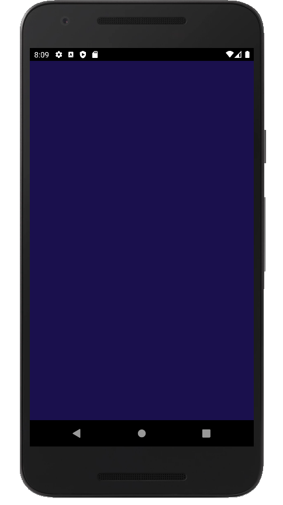 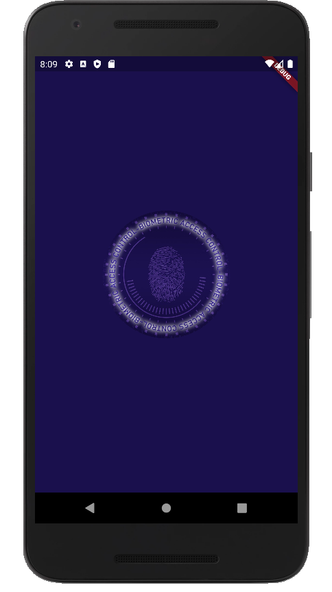 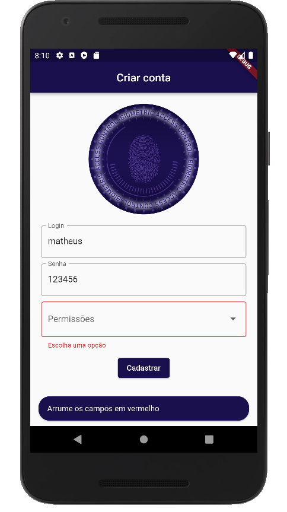 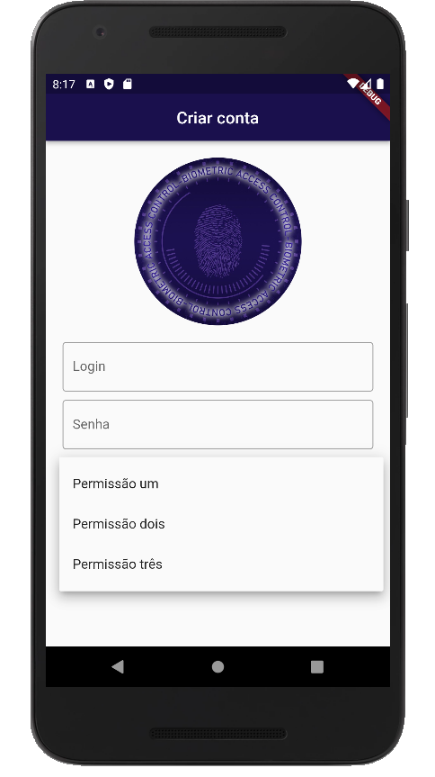 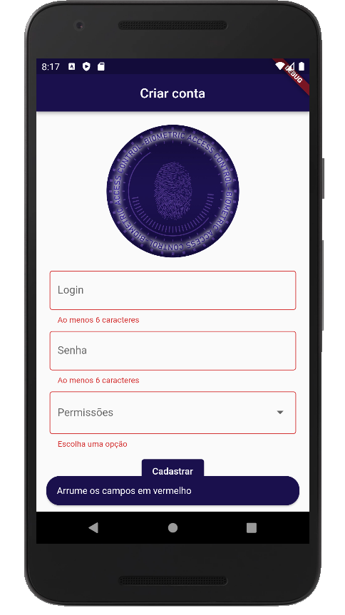 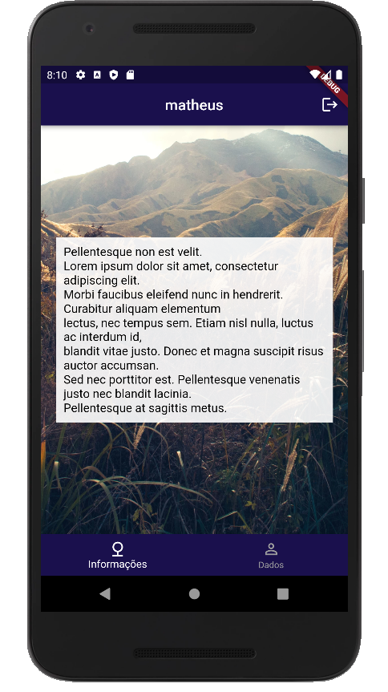 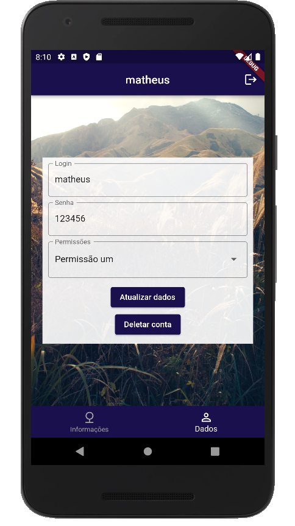 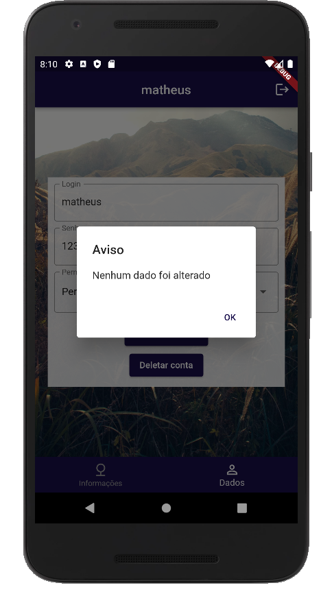  ") 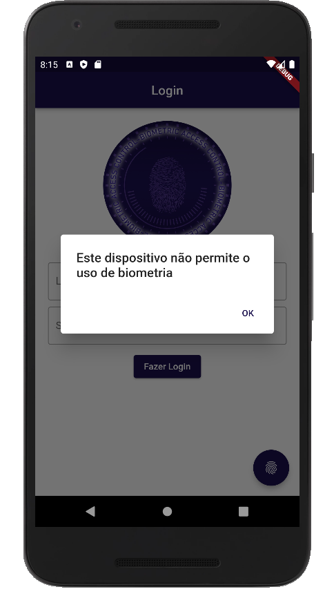 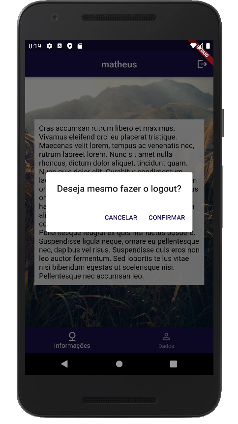 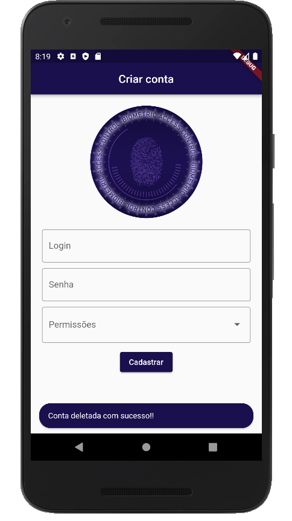 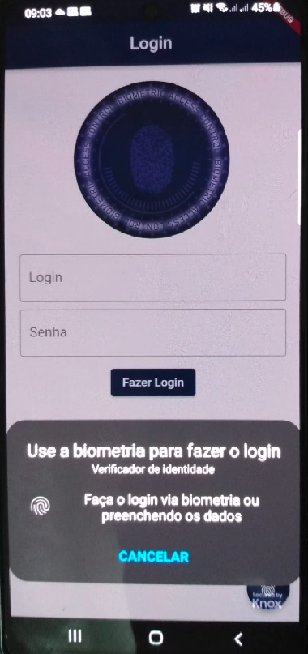

---

## 🚀 Tecnologias e recursos utilizados

Este projeto foi desenvolvido com as seguintes tecnologias:
- [**Visual Studio Code**](https://code.visualstudio.com/): um editor de código-fonte desenvolvido pela Microsoft, que é multiplataforma e muito utilizado;
- [**Dart**](https://dart.dev/): Linguagem de programação;
- [**Flutter**](https://flutter.dev/): Uma UI Toolkit que traz várias facilidades para desenvolvimento Cross-Platform;

---

## 🔧 Instalação e execução

Para você poder instalar e executar esta aplicação, será preciso ter instalado o git para clonar este repositório e ter a SDK do Flutter instalada na máquina para poder executar o projeto, de preferência na mesma versão usada por mim, que é a 2.10.1. Com isso, basta executar *flutter clean*, e, depois, *flutter pub get* para baixar todas libs em suas respectivas versões do projeto.
 
Só com isso já é possível buildar o APP.

<h5 align="center">
  &copy;2022 - <a href="https://github.com/matheusEduardoTavares">Matheus Eduardo Tavares</a>
</h5>